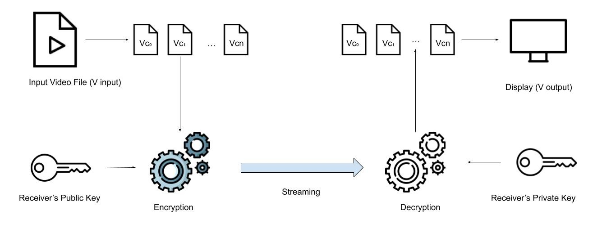
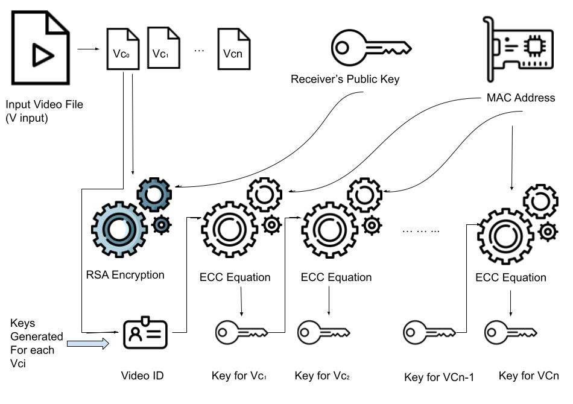

# A Novel Hybrid Multikey Cryptography Technique for Video Communication with Client-Server Model

Protecting copyright and preventing piracy has become a crucial concern in real-time video streaming systems. This research project presents a revolutionary multi-key and hybrid cryptography approach to provide enhanced security for video communication.

The project implements a software solution for video encryption and decryption using a continuous system based on the Elliptic Curve Cryptography (ECC) approach as pseudorandom encryption key generators. This approach generates multiple keys to encrypt and decrypt small chunks of video files dynamically, based on the video data. The implementation follows a client-server model utilizing socket programming.

### Video Walkthrough
<video width="100%" height="100%" controls>
  <source src="assets/demo.webm" type="video/mp4">
  Your browser does not support the video tag
</video>


## Project Flow

1. User Registeration

	Here users input their email, password, MAC address, and import their public key on a Flask-developed web page. User data, including the public key, is securely stored in a SQLAlchemy database for future authentication and authorization. 

2. User Login and Dashboard

	Here Users login using their credentials, upon successful login, the dashboard displays video thumbnails, and provides a download button to obtain the client software for connecting to the streaming server. 

3. Server Side Key Generation

	The keys which are used to encrypt the video chunks are generated from the ECC equation.  First AES key is generated from the ECC equation which involves Video ID, remaining keys will be generated from the ECC equation which includes the previous key.

4. Video Encryption at Server Side

	The encryption is done for the each video chunk individually. The 0th indexed chunk will be encrypted using the RSA with the receivers public key. The 1st indexed video chunk will be encrypted with the AES using the key generated from the ECC equation which involves VID, remaining chunks will be encrypted with AES and the keys generated from ECC equation which includes previously generated ECC key.

5. Sending Encrypted Video through Sockets

	Encrypted video is transmitted over sockets using the client-server model. The video data is encrypted on the server side using a hybrid multikey cryptography technique and sent securely to the client for decryption, ensuring confidentiality during transmission.
	
6. Receiving Encrypted Video through Sockets

	Encrypted video is received through sockets in the hybrid multikey cryptography technique. The server receives the encrypted video data, which is then decrypted using the shared session key, ensuring confidentiality and enabling playback or further processing of the video content.
	
7. Client Execution

	During Client Execution, users run the client.py script on their local machine. The server requests the user to provide their email and password for verification. If the credentials entered match the ones used during registration, the server grants access and presents the user with a list of available videos. 

8. Additional Authentication

	In addition to the login credentials, users are prompted to enter their MAC address during authentication. This additional step helps to enhance security by verifying the user's identity and ensuring that the device they are using is authorized for access. 

9. Private Key Import

	In order to decrypt a received video from the server, the user is prompted to provide the path to their private key. This private key is necessary to unlock the encryption applied to the video. By importing the private key, the user can authenticate themselves and gain access to the encrypted content, enabling them to view the video in its original form.

10. Key Generation at client

	The keys will be generated in the same way they generated at the server side during the encryption.

11. Video Decryption and Playback:

	The video will be decrypted if the private key and MAC address of the user is reasonable. Once decrypted, the video is rendered and displayed by a media player, allowing users to watch it without significant delays or interruptions. This encryption and playback process safeguards copyrighted material and maintains content security and integrity..

## Encryption Flow

The video file encrypion flow as follows.

```
1. Input video file Vinput
2. Generate video chunks Vci from Vinput
3. Fetch the receiver's public key of the RPkey
4. Collect receiver's MAC address Rmac
5. Generate VID using Vc0
6. Store VID in a temporary file
7. Encrypt Vc0 using RSA
8. Generate Keya ← x^3 + VID * x + Rmac
9. Encrypt Vc1 using Keya and AES
10. for i := 2 to n do
11.    Generate Keya ← x^3 + Keya * x + Rmac
12.    Encrypt Vci using Keya and AES
13. end for
```

## Internal Processes:

- User Registration:
   - During registration, users are required to import their public key, along with their email, password, and MAC address.
- Encryption



   - The server-side encryption involves AES encryption of each 1MB chunk of the video file.



   - The encryption key used for AES is generated using a novel key generation technique that combines RSA and ECC.
- Decryption
   - The decryption was done at the client side same key generation was used here.

## Analysis of Results

### Time to generate keys

To determine the impact of the multi-key in the encryption and decryption process, the time required to generate the key was calculated in this experiment. The method and equation used to derive the keys are the same for both encryption and
decryption. So, for the sake of analysis, the delay calculated for encryption has been employed in this part. The receiver’s public key and partial video data serve as the basis for the key used to encrypt the first video chunk. The remaining keys are obtained using the receiver’s MAC address, public key, and previously computed key. Since the length of the parameters is consistent during this procedure, the time between each key does not vary much.

### Time to encrypt video chunks

This section has talked about how long it takes to encrypt each chunk. Although the video processing modules split the video file into chunks for each full frame, the implementation assumes the chunk size to be 1 MB. The video chunks are fed into the AES module before being transmitted. The chunks are mostly the same in that it varies between 1MB and 1.2MB, and the time taken to encrypt each also varies between 0.9 sec to 1.2 sec.

### Number of keys generated

The number of keys generated depends on the quantity of generated video chunks. This statistic has been considered for the study because the suggested solution uses multiple key technologies to provide improved security. Multiple keys have no impact on memory use because the keys are only momentarily saved at the transmitter and receiver sides. Furthermore, because each key is only utilized once, an increase in the number of keys has no impact on the fetching delay.

## Installing Entire Project

1. `git clone https://github.com/themj0ln1r/novel-cryptography-project.git`

2. `cd novel-cryptography-project`

3. python3 -m venv env

4. source env/bin/activate

5. pip3 install -r requirements.txt

Now you are set to run this project

- Move to Flask_App directory run the `app.py`

- Visit your localhost to view the webpage on action

- Register an account on the webpage

- Start the `server.py` and run the `client.py` 

- Input the required data in the `client.py` console

- Import your private to play the video 


**Keywords**: Hybrid Cryptography, Multikey Cryptography, Video Communication, Real-time Streaming, Elliptic Curve Cryptography (ECC), AES Encryption, Client-Server Model, Socket Programming, Flask, SQLAlchemy, RSA, Key Generation

### References

- Project Guided By [Sir, Kumar Anurupam](https://www.linkedin.com/in/kumar-anurupam-a3464037/)
- Research paper published by [Sir. M. Ramakrishna](https://www.linkedin.com/in/rkmundugar/)
- Cryptography knowledge by [Prof.Christof paar](https://www.crypto-textbook.com/)
- Socket Programming tutorial by [Real Python](https://realpython.com/python-sockets/)
- Flask tutorial by [freecodecamp](https://www.youtube.com/watch?v=Z1RJmh_OqeA)

### Additional Links

For the full walk-through : [Blog](https://th3m4r10.github.io/)

> `Please let me know there was any bug/flaw in the implementation..`
